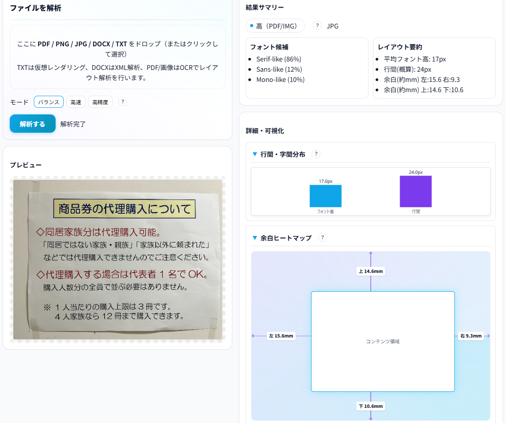

<!--
---
title: FontOrigin Analyzer
category: forensic
difficulty: 3
description: A web-based forensic tool that analyzes document fonts and layout patterns to infer their origin.
tags: [font, forensic, document, osint, ui]
demo: https://ipusiron.github.io/fontorigin-analyzer/
---
-->

# FontOrigin Analyzer - 文書出所解析ツール


[](https://ipusiron.github.io/fontorigin-analyzer/)

**Day090 - 生成AIで作るセキュリティツール100**

**FontOrigin Analyzer** は、文書内のフォント・行間・余白・インデントなどの**版面情報（layout metrics）**を分析し、それらの癖（FontPrint）から文書の **出所（Origin）** や **一致性** を推定するツールです。

フォレンジックやOSINTの用途で役立ちます。

ブラウザーのみで動作し、ファイルはローカルで解析されるため、プライバシーを保ったまま安全に試すことができます。

---

## 🌐 デモページ

👉 **[https://ipusiron.github.io/fontorigin-analyzer/](https://ipusiron.github.io/fontorigin-analyzer/)**

ブラウザーで直接お試しいただけます。

---

## 📸 スクリーンショット

>
>*文書を含むPNGファイルの解析結果*

---

## 👥 対象ユーザー

本ツールは以下のような方々を対象としています：

### 🔬 セキュリティ・フォレンジック分野
- **デジタルフォレンジック研究者・実務者**
  文書改ざん検知、証拠保全、鑑定レポート作成の補助ツールとして
- **セキュリティエンジニア**
  組織内文書の出所追跡、情報漏洩経路の分析に
- **セキュリティ教育者・講師**
  フォレンジック実習・ワークショップの教材として

### 🕵️ 情報分析・調査分野
- **OSINT（オープンソース情報）アナリスト**
  公開文書の出所検証、SNS拡散文書の真贋鑑定に
- **ジャーナリスト・報道関係者**
  リーク文書の信頼性評価、情報源の特定補助に
- **ファクトチェッカー**
  偽情報・ディスインフォメーション対策、AI生成文書の検出訓練に

### 🎓 学術・研究分野
- **情報科学・AI研究者**
  文書解析アルゴリズム、機械学習モデルの学習データ生成に
- **タイポグラフィ・デザイン研究者**
  フォント使用傾向の定量分析、組版パターンの研究に
- **大学生・大学院生**
  セキュリティ・情報分析の学習、卒業研究・論文のテーマとして

### 💼 その他の実務者
- **法務・コンプライアンス担当者**
  契約書・公文書の版面整合性確認、偽造文書リスクの評価に
- **出版・編集者**
  文書フォーマットの品質管理、テンプレート標準化の検証に
- **アーキビスト・図書館員**
  歴史文書のデジタル化・分類、文書群の出所整理に

### 🧑‍💻 技術愛好家
- **セキュリティ技術に興味がある方**
  文書フォレンジックの仕組みを学びたい方
- **OSS開発者**
  フォント解析ツールのソースコード学習、機能拡張の検討に
- **AI・機械学習エンジニア**
  文書特徴量抽出のパイプライン実装例として

---

## 🔍 フォレンジックとOSINTでの活用

**FontOrigin Analyzer** は、フォントや版面に残る微細な「癖」を解析することで、文書の出所を推定したり、偽造や改ざんを見抜いたりする訓練に活用できます。

その性質上、**デジタルフォレンジック**と**OSINT（オープンソース情報分析）** の両領域で有効な学習・調査ツールとなります。

---

### 🧠 デジタルフォレンジック（鑑定・証拠解析）での活用

- **文書改ざん検知**  
  同一文書の改訂版を比較し、フォントや余白の差から  
  編集・再出力の痕跡を可視化できます。  
  Word→PDF変換によるフォント置換なども、改ざん指標として確認可能です。

- **出所特定・作成環境の鑑識**  
  埋め込まれたフォントセットや余白・行間の規則を解析し、  
  組織・端末・テンプレートの癖を推定できます。  
  例：「游明朝＋上下30mm＋インデント14pt」など特定機関固有の書式を識別。

- **タイムライン再構築**  
  フォントや行間の変化から、文書がどの順序で編集・変換されたかを復元。  
  編集チェーン（Word → PDF → 画像）を追うことができます。

---

### 🕵️‍♂️ OSINT（オープンソース情報分析）での活用

- **情報源の信頼性評価**  
  SNSや報道で流れる文書画像の「出所らしさ」を比較。  
  例：「政府文書」と称する画像だがフォントが「民間Office標準」⇒偽装の可能性。

- **機関ごとの書式パターン分析**  
  公開文書をデータベース化し、匿名リーク文書との類似を確認。  
  「この余白比率は○○省のテンプレートと一致」など、出所候補を絞り込めます。

- **ディスインフォメーション対策**  
  生成AIや偽造文書では行間やフォントペアが不自然になりやすい。  
  本ツールで抽出した特徴量をもとに、AI生成らしさ／人間制作らしさを見分ける教育に活用可能です。

---

### 🧩 ヒューマン・レイアウト・フォレンジクス

FontOrigin Analyzer が扱うのは、**人間の癖が反映されたレイアウト痕跡**です。  

- **フォレンジック的には：** 改ざん・出所・証拠性の確認
- **OSINT的には：** 出所推定・偽情報検証・発信源分析  

つまり、「**目に見えないメタ情報を読む**」訓練ツールとして、フォレンジックとOSINTの両分野に橋を架ける存在です。

---

## ✨ 主な特徴

- **完全クライアント処理**（HTML + JS + WASM）
- **PDF / 画像 / DOCX / TXT** に対応
- **フォント候補・行間・余白・グリフ形状**などを可視化
- **FontPrint（指紋）JSON** を生成して保存・比較可能
- **4タブ構成のUI**：
  1️⃣ 解析　2️⃣ 比較　3️⃣ コーパス　4️⃣ ガイド
- **ライト／ダークテーマ切替**（右上丸ボタン／☀→🌙トグル）
- **吹き出しヘルプ（？）**：複雑なUI要素の右に表示、ホバーで解説
- **GitHub Pagesで動作**（サーバー不要）

---

## 🧩 タブ構成と機能

| タブ | 主な機能 |
|:--|:--|
| **解析** | 文書をアップロードして特徴を抽出。FontPrintを生成。<br>・3つの解析モード（バランス/高速/高精度）<br>・フォント候補、余白ヒートマップ、グリフ比較、行間チャートを表示<br>・JSON形式でエクスポート可能 |
| **比較** | 2つの文書を並べてフォント・版面差分を可視化。<br>・左右に異なるファイルを読み込み<br>・OCR解析で実際のフォント・余白を比較<br>・コサイン類似度で一致度スコアを算出 |
| **コーパス** | 保存済みFontPrintの履歴を管理し、再分析。<br>・localStorageに保存（端末内のみ）<br>・JSON形式でエクスポート/インポート可能<br>・過去の解析結果を一覧表示・削除 |
| **ガイド** | ファイル形式別の注意点・倫理的利用指針を解説。<br>・対応形式の詳細説明<br>・フォレンジック・OSINT活用例<br>・倫理ガイドライン |

---

## 📊 詳細・可視化機能の活用

解析タブの「**詳細・可視化**」セクションでは、文書の版面特徴を視覚的に分析できます。これらの機能は、文書の出所推定や改ざん検知において重要な手がかりを提供します。

### 1️⃣ 行間・字間分布

**何がわかるか:**
- フォント高さと行間のバランスを棒グラフで可視化
- 文書作成ソフトやテンプレートの癖を特定

**活用例:**
- 「Wordのデフォルト設定（行間1.15）」vs「LaTeX（行間1.2）」の判別
- 同一組織内の文書テンプレート（例：省庁の公文書フォーマット）との照合
- 手動で調整された行間（改ざんや編集の痕跡）の検出

---

### 2️⃣ 余白ヒートマップ

**何がわかるか:**
- 上下左右の余白サイズ（mm単位）を視覚的に表示
- 余白比率は組織やテンプレート固有の特徴

**活用例:**
- **組織判別**: 「上30mm/下25mm/左右20mm」など、特定機関の書式との一致確認
- **改ざん検知**: 複数ページで余白が不揃い → 別々の文書を合成した可能性
- **出所推定**: 米国式（1インチ余白 ≒ 25.4mm）vs 日本式（20mm〜30mm）の判別
- **テンプレート特定**: 「Microsoft Word標準」vs「Google Docs標準」vs「LaTeX article」の識別

**フォレンジック的重要性:**
余白は**人間が無意識に設定する癖**が出やすく、文書の「指紋」として極めて有効です。
例：公的文書と称するPDFの余白が「Wordデフォルト（25.4mm）」→ 偽造の可能性

---

### 3️⃣ 代表グリフ比較

**何がわかるか:**
- OCRで検出した代表的な文字（a, e, g, 数字1など）の形状を抽出
- フォントファミリーや字形の特徴を可視化

**活用例:**
- **フォント判別**: セリフ体（明朝・Times）vs サンセリフ体（ゴシック・Arial）
- **手書き風フォント検出**: 均一でない字形から手書き・スキャン文書の識別
- **OCR品質確認**: 文字認識の境界ボックス（bbox）が正しく取れているかチェック
- **AI生成文書の検証**: 生成AIが使うフォントには特定の傾向があることも

**技術的補足:**
グリフ（glyph）とは、フォント内の個々の文字図形のこと。
同じ「a」でも、Times New RomanとArial、游明朝とヒラギノでは形状が異なります。
この微細な差異を可視化することで、文書の作成環境を推定できます。

---

### 💡 総合的な活用シナリオ

- セキュリティ講義での**文書フォレンジック実習教材**  
- 研究室での**レイアウト自動判別アルゴリズム**のデモ  
- 出版・報道向けの**出所分析教育**  
- OSS・AI研究のための**フォント特徴量抽出基盤**の例題

#### 🚩 シナリオ1: CTF（Capture The Flag）でのフォレンジック問題

**課題設定:**
「このPDFファイルから、文書を作成した組織のコードネームを特定せよ」

**解析手順:**
1. **解析タブ**でPDFをアップロード → FontPrint JSON生成
2. **余白ヒートマップ**を確認
   - 上: 28.5mm、下: 23.0mm、左右: 19.5mm
   - この比率は特定企業のLaTeXテンプレートと一致
3. **代表グリフ比較**でフォント判別
   - "Computer Modern" フォントの特徴的なセリフ形状を検出
   - → LaTeX標準フォントで作成された可能性が高い
4. **行間分布**を分析
   - 行間が1.2（LaTeXのデフォルト `\baselinestretch`）
5. **コーパスタブ**に事前保存された組織別テンプレート集と照合
   - コサイン類似度 95% で "OrganizationX_latex_template" と一致
   - → フラグ: `FLAG{OrganizationX}`

**学習ポイント:**
- 版面情報は削除困難なメタデータとして機能
- 複数の特徴を組み合わせることで高精度な特定が可能
- LaTeX/Word/Google Docsなどツール固有の癖を学べる

---

#### 🔴 シナリオ2: レッドチーム演習でのソーシャルエンジニアリング偽装検証

**演習目的:**
標的組織の正規文書に偽装したフィッシングメールの添付PDFを作成し、ブルーチームが検知できるか検証

**レッドチームの作業:**
1. 標的組織の公開文書（IR資料、採用案内など）を複数収集
2. **FontOrigin Analyzer**で各文書を解析
   - 余白: 上25mm / 下20mm / 左右18mm（統一規格）
   - フォント: 游ゴシック Medium + 游明朝 Light
   - 行間: 1.15（Word日本語版デフォルト）
3. これらの特徴を完全に再現したWordテンプレートを作成
4. フィッシング用PDFを生成して攻撃シミュレーション

**ブルーチームの検知:**
1. 受信PDFを**比較タブ**で既知の正規文書と照合
2. **余白ヒートマップ**で微妙な差異を発見
   - 左余白が17.8mm（正規は18.0mm）→ 0.2mmのズレ
3. **グリフ比較**でフォントレンダリング差を検出
   - Windows 10 vs Windows 11でのClearType設定の違いによる微細な差
4. → 偽装文書と判定、フィッシング攻撃を阻止

**演習成果:**
- レッドチーム: 高度な偽装技術の必要性を理解
- ブルーチーム: 版面フォレンジックによる検知手法を習得
- 組織全体: 文書テンプレートのセキュリティ管理の重要性を認識

---

#### 🕵️ シナリオ3: OSINT調査 - 匿名リーク文書の出所推定

**状況:**
SNSで「内部告発文書」と称するPDF画像が拡散。真偽不明。

**調査手順:**
1. **解析タブ**で画像をOCR解析
   - フォント候補: MS P明朝（98%）
   - 余白: 上30mm、下25mm、左右25mm（A4レター混在？）
   - 行間: 1.08（Wordデフォルト1.15より狭い）
2. **既知の内部文書**（過去のIR資料、採用ページPDF）をコーパスに登録
3. **比較タブ**で類似度スコアを算出
   - 余白パターン: 一致度 45%（標準的ではない）
   - フォント: MS P明朝（古いOffice 2003世代のフォント）
4. **判定:**
   - 正規の企業テンプレートとは不一致
   - 古いOfficeバージョンで作成された可能性
   - → 真贋判定には追加調査が必要（メタデータ、文体分析など）

**結論:**
版面情報だけでは確定できないが、「疑わしい点」を客観的に提示可能。
他の証拠（投稿時刻、文体、内容の整合性）と組み合わせて総合判断。

---

#### 📄 シナリオ4: 文書改ざん検知 - 契約書の版面不整合検出

**状況:**
電子契約書PDFの一部ページで条項が改変された疑いがある。

**検証手順:**
1. **全ページを個別に画像化**してFontOrigin Analyzerにアップロード
2. **各ページの余白・行間を比較**
   - 1-4ページ: 余白20mm、行間1.15（Word標準）
   - **5ページ目のみ**: 余白19mm、行間1.12（微妙なズレ）
3. **代表グリフ比較**
   - 1-4ページ: 游明朝 Regular
   - **5ページ目**: 游明朝 Regular（同じ）だが、字形がわずかに異なる
   - → 別のOSまたはOfficeバージョンで再出力された可能性
4. **行間チャート**で分布の一貫性をチェック
   - 5ページのみ異常な分布パターン

**結論:**
5ページ目は後から差し替えられた可能性が極めて高い。
PDFメタデータ（作成日時、作成ソフト）と併せて鑑定レポート作成。

**法的証拠性:**
本ツールの解析結果は「疑義の端緒」として機能。
正式な鑑定では専門ツール（Adobe Acrobat Pro、Forensic Toolkit等）と併用。

---

**🧠 重要な注意:**
これらの可視化は「推定の手がかり」であり、単独で真偽を断定できるものではありません。
複数の特徴を組み合わせて総合的に判断し、必要に応じて他の証拠と照合してください。

---

## 📂 対応ファイル形式と注意事項

### PDF / 画像（推奨）- 確からしさ: **高**
- **対応形式**: `.pdf`, `.png`, `.jpg`, `.jpeg`
- **解析方法**: Tesseract.js（OCR）でテキスト認識 → フォント高・行間・余白を抽出
- **特徴**: 版面情報が固定されており、もっとも正確な解析結果を得られます
- **処理時間**: 中〜長（OCR処理のため数秒〜数十秒）
- **プレビュー**: 実際のページをそのまま表示

**活用シーン:**
- スキャンされた紙文書の出所推定
- PDFに変換された公文書の検証
- 報道・SNSで拡散された文書画像の真贋鑑定

---

### DOCX（Wordファイル）- 確からしさ: **中**
- **対応形式**: `.docx`
- **解析方法**: ZIPを展開 → `word/document.xml`と`word/styles.xml`からスタイル情報を抽出
- **特徴**:
  - XMLから直接、余白（pt）・フォントサイズ（pt）・段落情報を取得
  - OCR不要のため高速処理
  - 本文テキストも1ページ目のみプレビュー表示
- **注意点**: XML上の定義と実際のレンダリング結果が異なる場合あり
  - 例: 環境にフォントがない場合、代替フォントで表示される
  - 埋め込みフォント vs システムフォントの違い
- **プレビュー**: XMLから本文を抽出し、余白ガイド付きで1ページ目を描画

**活用シーン:**
- Wordテンプレートの書式分析
- 組織内文書の標準フォーマット検証
- 編集履歴の比較（バージョン間の余白・フォント変更検出）

---

### TXT（テキストファイル）- 確からしさ: **低**
- **対応形式**: `.txt`
- **解析方法**: 仮想的にキャンバス上でレンダリングして解析
- **特徴**:
  - 版面情報を持たないため、ツール内で仮想的にレイアウトを再現
  - フォント・サイズ・行間はツール側で固定値を仮定
  - **環境依存が大きい**（同じTXTでもフォント次第で結果が変わる）
- **文字コード対応**: UTF-8 / Shift_JIS 自動判定
  - 文字化け検出時は自動的にShift_JISで再読み込み
- **プレビュー**: 仮想レンダリング結果を表示

**活用シーン:**
- プレーンテキストの視覚的なレイアウト検証
- マークダウンやコードファイルの表示確認
- テキストベース文書の簡易分析

---

### DOC（旧形式）
- `.doc` はバイナリ形式のため、**直接解析不可**
- **対処法**: WordやLibreOfficeで `.docx` または `.pdf` に変換してください

---

> 🧠 **確からしさの比較:**
> - **高（PDF/画像）**: 固定レイアウトをOCRで正確に解析
> - **中（DOCX）**: XMLから直接取得だが環境で表示が変わる可能性
> - **低（TXT）**: 仮想レンダリングのため条件依存
>
> **推奨**: フォレンジック用途では **PDF/画像** を使用してください。

---

## 🔒 プライバシーと倫理ガイド

- **完全クライアント実行**（ファイルはブラウザー内で処理され、サーバー送信なし）
- コーパス保存機能は `localStorage` 利用（個人端末のみ保持）
- 悪意ある解析目的での利用は禁止。教育・研究・展示用途を前提としています。
- 公開デモには**個人情報や機密文書をアップロードしないでください。**

---

## 📁 ディレクトリー構成

```
fontorigin-analyzer/
├── index.html          # メインUI（4タブ構成: 解析/比較/コーパス/ガイド）
├── script.js           # 全ロジック（OCR、特徴抽出、比較）
├── style.css           # テーマシステム、コンポーネントスタイル
├── assets/             # 静的リソース
│   ├── icon.svg        # ファビコン
│   └── screenshot.png  # デモ画像
├── README.md           # プロジェクト概要（このファイル）
├── ARCHITECTURE.md     # 技術実装詳細・アルゴリズム解説
├── SECURITY.md         # セキュリティポリシー・免責事項
├── CLAUDE.md           # Claude Code向けプロジェクト指示
├── LICENSE             # MITライセンス
├── .gitignore          # Git除外設定
├── .nojekyll           # GitHub Pages設定（Jekyllビルド無効化）
└── .git/               # Gitリポジトリメタデータ
```

---

## 🏗️ 技術詳細・開発者向けドキュメント

本ツールの内部実装、アルゴリズム、設計上の工夫について詳しく知りたい開発者の方は、以下のドキュメントをご覧ください：

**📘 [ARCHITECTURE.md - 技術アーキテクチャ詳細](ARCHITECTURE.md)**

以下のトピックを詳しく解説しています：

- **ファイル形式別の処理パイプライン** (PDF/Image/DOCX/TXT)
- **特徴量抽出アルゴリズム** (フォントサイズ、行間、余白推定)
- **FontPrint生成ロジック** (ハッシュ化、ベクトル化)
- **コサイン類似度による比較アルゴリズム**
- **CJK文字の折り返し処理** (日本語テキスト対応)
- **ポータルツールチップ実装** (z-index問題の解決)
- **パフォーマンス最適化** (Canvas解像度制御、Web Worker活用)
- **セキュリティ設計** (CSP, SRI, XSS対策)

---

## 📄 ライセンス

MIT License – 詳細は [LICENSE](LICENSE) を参照してください。

---

## 🛠 このツールについて

本ツールは、「生成AIで作るセキュリティツール100」プロジェクトの一環として開発されました。
このプロジェクトでは、AIの支援を活用しながら、セキュリティに関連するさまざまなツールを100日間にわたり制作・公開していく取り組みを行っています。

プロジェクトの詳細や他のツールについては、以下のページをご覧ください。

🔗 [https://akademeia.info/?page_id=42163](https://akademeia.info/?page_id=42163)
